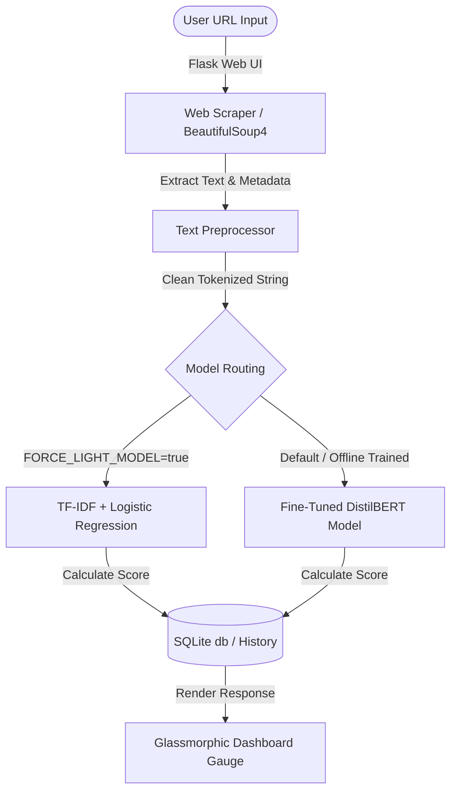

# 🕵️‍♂️ Predatory Publishers Detector

> Risk intelligence for research journals. Evaluate any academic journal website in seconds to check if it exhibits signs of predatory publishing.

---

## 🌟 Overview

The **Predatory Publishers Detector** is a premium, web-based tool designed to help researchers, librarians, and supervisors quickly evaluate the legitimacy of academic journals. 

By simply analyzing a journal's public website, the system scrapes its homepage, cleans the content, and runs it through a machine-learning pipeline to estimate its predatory risk score.



---

## ✨ Key Features

- **🌐 Public Web Scraper**: Accesses and parses metadata (titles, description tags) and body content from public pages safely.
- **🧠 Hybrid AI Engine**:
  - **Premium Mode (DistilBERT)**: Deep semantic classification utilizing transformer-based sequence classification.
  - **Lightweight Mode (TF-IDF + Logistic Regression)**: Low-footprint, high-speed estimator optimized for constrained cloud servers (e.g. Render Free Tier).
- **📊 Glassmorphic Dashboard**: Sleek, themeable dark/light dashboard with interactive gauge animations to visualize predatory risk and model confidence.
- **🔒 Secure History Tracking**: User registration and history logs, built on a local SQLite server.
- **⚙️ Admin Dashboard**: Manage user permissions, role authorizations, and export logs to CSV.

---

## 🚀 Getting Started

### 📋 Prerequisites

- Python 3.10+
- SQLite3

### 🛠️ Local Installation

1. **Clone the repository**:
   ```bash
   git clone https://github.com/PranavD53/Predatory_Publishers_Detection.git
   cd Predatory_Publishers_Detection
   ```

2. **Create and activate a virtual environment**:
   ```bash
   python -m venv venv
   # On Windows (PowerShell):
   .\venv\Scripts\Activate.ps1
   # On Linux / macOS:
   source venv/bin/activate
   ```

3. **Install dependencies**:
   ```bash
   pip install -r requirements.txt
   ```

4. **Initialize database & start the application**:
   ```bash
   python app.py
   ```
   The app will run locally at `http://127.0.0.1:5000`.

---

## ⚙️ Configuration & Environment Variables

You can configure the behavior of the application by setting the following environment variables:

| Environment Variable | Description | Default Value |
| :--- | :--- | :--- |
| `FORCE_LIGHT_MODEL` | Set to `true` to force the app to use the lightweight scikit-learn model instead of the heavy BERT model (essential for hosts with < 1GB RAM). | `false` |
| `SECRET_KEY` | Flask session secret key for security. | *(Auto-generated default)* |
| `PORT` | Port number on which the web server will run. | `5000` |

---

## 📦 Production Deployment

### 1. Render Deployment (Recommended)
This application includes lazy-loading of heavy dependencies, optimized specifically for fast-boot cloud environments.

* **Build Command**: `pip install -r requirements.txt`
* **Start Command**: `gunicorn "app:create_app()"`
* **Environment Variable**: Set `FORCE_LIGHT_MODEL=true` if using Render's Free tier to ensure runtime memory stays under **512 MB**.

### 2. Docker Deployment
A clean `Dockerfile` can be set up in the root directory:

```dockerfile
FROM python:3.10-slim
ENV PYTHONDONTWRITEBYTECODE=1
ENV PYTHONUNBUFFERED=1
WORKDIR /app
COPY requirements.txt .
RUN pip install --no-cache-dir -r requirements.txt
COPY . .
EXPOSE 5000
CMD ["gunicorn", "--bind", "0.0.0.0:5000", "--workers", "2", "app:create_app()"]
```

---

## 🗂️ Project Structure

* `app.py` — Flask application routing and authentication context.
* `predatory_detector/` — Backend core:
  * `scraper.py` — Scrapes title, description and text using BeautifulSoup.
  * `preprocess.py` — Text cleanup and string normalization.
  * `model.py` — Hybrid prediction pipeline (scikit-learn & BERT).
  * `database.py` — SQLite schema and CRUD database functions.
  * `train_bert.py` — Offline PyTorch script to fine-tune DistilBERT.
* `models/` — Holds the trained ML model files.
* `templates/` — HTML template layouts (admin interface, auth pages, results console).
* `static/` — Glassmorphism CSS stylesheets and vanilla JavaScript handlers.

---

## ⚠️ Disclaimer
- The detector does not access paywalled or login-protected pages.
- It provides a **risk assessment** based on website copy similarities to known predatory journals and should not be used as the single deciding factor for publication decisions. Always pair its reports with institutional guidance.

---

## 🚀 Version 2.0 Specifications & Updates

The application has been upgraded to **Version 2.0**, introducing advanced multi-laptop database synchronization, custom UI components, expanded standard directories, and enhanced user workflows:

### 1. 🗄️ Multi-Device Synchronization & Remote Database Support
* **Supabase / PostgreSQL Integration**: Seamlessly switches between a local SQLite database and a remote PostgreSQL database (like Supabase).
* **Auto Environment Loader**: Automatically detects a `.env` file in the project root to load configuration variables (e.g., `DATABASE_URL`) without external package requirements.
* **Transparent Query Translators**: Features built-in parameters and row translators inside `database.py` that map SQL variables (`?` vs `%s`) and row cursor factories dynamically between SQLite and PostgreSQL databases.

### 2. 🗂️ Expanded Whitelist & Blacklist Directory
* **Expanded Seeds (700+ entries)**: Automatically seeds **350 whitelisted DOAJ journals** (retrieved dynamically using paginated DOAJ API requests) and **350 blacklisted Beall's List journals** (retrieved from stop-predatory-journals CSV mirrors).
* **Deterministic Override Confidence (80%–90%)**: Matches against directories automatically override ML predictions. To keep scores realistic, directory overrides are assigned a deterministic, stable confidence score between **80% and 90%** (calculated via a domain MD5 hash) rather than a raw 100% value.

### 3. 🎨 Custom Glassmorphism Modals
* **Theme-Aware Pop-ups**: Replaced browser-native `confirm()` account deletion alerts with custom-styled modals that follow the glassmorphic dark/light themes.
* **Transitions**: Integrated smooth slide-in keyframe animations, blurred backdrop overlays (`backdrop-filter`), and responsive overlay cancel options.

### 4. 🔒 User-Specific History & CSV Export
* **Isolated Log Pages**: Added a dedicated `/history` endpoint that restricts history visibility to each user's unique checks.
* **Data Portability**: Users can export and download their complete historical scan results locally as a standardized CSV file.
* **Real-time Prepending**: New searches immediately prepend to the dashboard list using asynchronous JavaScript, avoiding full page refreshes.

### 👑 5. Instagram-Style Admin Approvals
* **Access Requests**: Standard users can request admin permissions from a dashboard banner. Status displays dynamically as `Pending ⏳`, `Approved ✅`, or `Declined ❌`.
* **Admin Controls**: Admins receive pending requests in the Admin Panel and can approve, reject, or revoke credentials instantly.

